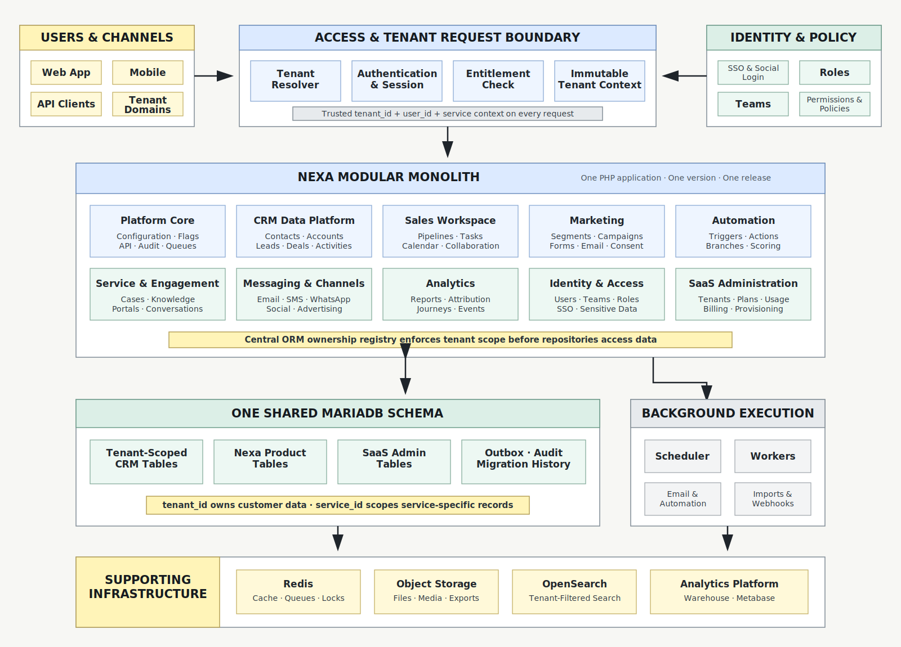

# Nexa

Nexa is a unified customer platform for CRM, sales, marketing automation, customer engagement and analytics.

This repository supports development by the designated Nexa project team. The team is not currently accepting unsolicited feature contributions, implementation pull requests or public support requests.

## Product Areas

- Customer and company relationship management
- Sales pipelines and team productivity
- Marketing campaigns and automation
- Email, messaging and customer conversations
- Reporting, attribution and customer analytics
- SaaS administration, plans and tenant operations

## System Architecture

Nexa uses a **modular monolith with supporting platform services**. It is not a full microservices architecture. The customer-facing product is one versioned PHP application with clear module boundaries, one release process and one shared user experience. Background workers use the same application contracts, while high-volume event and analytics workloads may use separate supporting infrastructure.

### Core Product Modules

- Platform core: shared configuration, feature flags, queues, audit events and API conventions.
- CRM data platform: accounts, contacts, leads, opportunities, activities, custom objects and associations.
- Sales workspace: pipelines, tasks, calendars, collaboration and account-centered workflows.
- Marketing: contacts, segments, campaigns, forms, consent, email and deliverability.
- Automation: triggers, actions, delays, branching, scoring and omnichannel orchestration.
- Service and engagement: cases, knowledge, portals, conversations, bots and shared inboxes.
- Messaging and channels: team email, SMS, WhatsApp, social, advertising and provider integrations.
- Analytics: reporting, attribution, customer journeys, behavioral events and governed metrics.
- Identity and access: users, teams, roles, permissions, SSO, sensitive data and audited support access.
- SaaS administration: tenants, plans, entitlements, usage, subscriptions, provisioning and operator controls.

### Architecture Diagram



Transactional data uses a **shared-schema multi-tenant model**. EspoCRM core tables, Nexa modules and SaaS administration tables live in one MariaDB schema. Every customer-owned row is protected by mandatory `tenant_id` scope; service-owned records and entitlements additionally use `service_id`.

## Supporting Infrastructure

Supporting infrastructure will be introduced as product scale and operational requirements justify it:

- Redis for cache, queues, distributed locks and rate limits.
- Object storage for attachments, imports, exports and media.
- OpenSearch for global search and high-volume event queries.
- An analytics database with Metabase or equivalent reporting tools.
- Dedicated workers for marketing email, automation, imports, webhooks and scheduled processing.

These components support the modular monolith and do not change its core architecture. Infrastructure adoption must include tenant isolation, monitoring, backup, security and local-development support.

## Team Documentation

Team members should read the documents relevant to their work before modifying shared contracts:

- [Feature inventory](docs/product/feature-inventory.md): functional and SaaS requirements.
- [Module and build roadmap](docs/product/module-build-roadmap.md): module ownership, dependency order and delivery phases.
- [SaaS architecture recommendation](docs/architecture/espocrm-saas-architecture-recommendation.md): recommended product and data architecture.
- [Shared-schema tenancy ADR](docs/architecture/ADR-0002-shared-schema-multitenancy.md): accepted tenant-isolation decision.
- [Superseded database-per-tenant ADR](docs/architecture/ADR-0001-tenant-database-isolation.md): retained decision history.
- [SaaS data architecture](docs/architecture/saas-data-architecture.md): tenant scope, services, migration and operational model.
- [Development collaboration](docs/development/phase-0-collaboration.md): shared code and database workflow.
- [Environment baseline](docs/development/environment-baseline.md): required versions and extensions.
- [Git workflow](docs/development/git-workflow.md): branches, commits, pull requests and releases.
- [Delivery management](docs/development/delivery-management.md): Project fields, milestones, sprints, labels and issue workflow.
- [Release process](docs/development/release-process.md): version changes, tags and GitHub Releases.
- [XAMPP setup](docs/development/xampp-setup.md): detailed Windows/XAMPP installation.
- [WampServer setup](docs/development/wampserver-setup.md): detailed Windows/WampServer installation.

## Development Baseline

| Component | Version |
|---|---|
| Application release | 9.1.9 |
| PHP | 8.2.x |
| MariaDB | 10.11 |
| Docker Compose | v2 |

Changes to the baseline require an approved pull request that updates local setup, CI and compatibility checks together.

## Docker Setup

Prerequisites: Git, PowerShell 5.1+ and Docker Desktop in Linux-container mode.

```powershell
git clone https://github.com/NaxoCRM-Team/nexa.git
cd nexa
powershell -ExecutionPolicy Bypass -File scripts/dev/setup.ps1
```

The clone already contains the complete pinned application source and dependencies. The setup command creates ignored local credentials, validates the environment, waits for healthy application services and applies all checksum-tracked shared-schema migrations and development seeds.

No application archive is downloaded from the official website during normal Docker setup. Docker may automatically pull the pinned PHP/application runtime image and MariaDB image when they are not already present; `./espocrm` is then bind-mounted over `/var/www/html`, so the running application code is the exact version committed to this repository.

Open <http://localhost:8080>. Local administrator credentials are stored in the ignored `.env` file.

Development setup also creates two isolated demo tenants. Both use the username `demo-admin` and the password configured as `ADMIN_PASSWORD` in the ignored `.env` file:

- <http://tenant-a.localhost:8080>
- <http://tenant-b.localhost:8080>

Re-run demo login provisioning without changing tenant data:

```powershell
powershell -ExecutionPolicy Bypass -File scripts/dev/provision-demo-tenants.ps1 -Mode Docker
```

```powershell
docker compose ps
docker compose logs -f espocrm
docker compose down
```

`docker compose down` retains local application and database data. Do not add `--volumes` unless the local environment is intentionally being discarded.

## XAMPP Setup

XAMPP contributors use the same Git repository, application release, custom files and database migrations as Docker contributors. XAMPP is only a different way to run Apache and PHP locally.

### 1. Install the Required Software

Install:

- Git for Windows.
- XAMPP with PHP 8.2.
- MariaDB 10.11.
- PowerShell 5.1 or later.

Do not use XAMPP's bundled MariaDB 10.4 as the project compatibility baseline. Run MariaDB 10.11 separately and leave XAMPP MySQL stopped.

### 2. Clone the Repository

```powershell
Set-Location C:\xampp\htdocs
git clone https://github.com/NaxoCRM-Team/nexa.git
Set-Location nexa
```

### 3. Prepare the Source and Local Environment

```powershell
$env:Path = "C:\xampp\php;$env:Path"
powershell -ExecutionPolicy Bypass -File scripts/dev/setup.ps1 `
  -SkipStart
```

This creates an ignored `.env` and checks PHP extensions and the pinned application version. Git already supplies `application/`, `bin/`, `client/`, `custom/`, `install/`, `public/`, `vendor/` and the required root application files, including all committed Nexa redesigns and feature changes. No application archive or official-website download is needed.

Review the generated settings:

```powershell
Get-Content .env
```

Change `ESPOCRM_SITE_URL` to `http://nexa.local` for the XAMPP installation. Never commit `.env`.

### 4. Create the Local Database

Start the MariaDB 10.11 Windows service. Connect with its administrator account:

```powershell
& 'C:\Program Files\MariaDB 10.11\bin\mariadb.exe' -u root -p
```

Create the local database and application user. Replace `<DB_PASSWORD>` with the `DB_PASSWORD` value from `.env`:

```sql
CREATE DATABASE espocrm
    CHARACTER SET utf8mb4
    COLLATE utf8mb4_unicode_ci;

CREATE USER 'espocrm'@'localhost'
    IDENTIFIED BY '<DB_PASSWORD>';

GRANT ALL PRIVILEGES ON espocrm.*
    TO 'espocrm'@'localhost';

FLUSH PRIVILEGES;
```

Each developer owns an independent local database. Do not import another developer's full database dump.

### 5. Configure Apache

Open `C:\xampp\apache\conf\httpd.conf` and confirm these lines are enabled:

```apache
LoadModule rewrite_module modules/mod_rewrite.so
Include conf/extra/httpd-vhosts.conf
```

Add this virtual host to `C:\xampp\apache\conf\extra\httpd-vhosts.conf`:

```apache
<VirtualHost *:80>
    ServerName nexa.local
    DocumentRoot "C:/xampp/htdocs/nexa/espocrm"

    <Directory "C:/xampp/htdocs/nexa/espocrm">
        Options FollowSymLinks
        AllowOverride All
        Require all granted
    </Directory>
</VirtualHost>
```

As Administrator, add this entry to `C:\Windows\System32\drivers\etc\hosts`:

```text
127.0.0.1 nexa.local
```

Start Apache from the XAMPP Control Panel. Keep the XAMPP MySQL service stopped when MariaDB 10.11 is running on port 3306.

### 6. Complete Browser Installation

Open <http://nexa.local/install> and use:

| Installer setting | Value |
|---|---|
| Database platform | MySQL/MariaDB |
| Host | `127.0.0.1` |
| Port | `3306` |
| Database | `espocrm` |
| Database user | `espocrm` |
| Database password | `DB_PASSWORD` from `.env` |
| Administrator username | `ADMIN_USERNAME` from `.env` |
| Administrator password | `ADMIN_PASSWORD` from `.env` |

Use the actual MariaDB port if it differs from `3306`.

### 7. Apply Shared Schema, Rebuild and Verify

```powershell
Set-Location C:\xampp\htdocs\nexa
powershell -ExecutionPolicy Bypass -File scripts/dev/apply-shared-schema.ps1 `
  -Mode Local `
  -ClientPath 'C:\Program Files\MariaDB 10.11\bin\mariadb.exe' `
  -Database espocrm `
  -User espocrm `
  -IncludeDevelopmentSeeds

Set-Location C:\xampp\htdocs\nexa\espocrm
& 'C:\xampp\php\php.exe' rebuild.php
& 'C:\xampp\php\php.exe' clear_cache.php

Set-Location C:\xampp\htdocs\nexa
powershell -ExecutionPolicy Bypass -File scripts/dev/verify.ps1
```

Open <http://nexa.local>, sign in and confirm Accounts, Contacts, Leads and Opportunities load correctly.

### 8. Enable Scheduled Jobs

Create a Windows Task Scheduler job that runs the following command every minute:

```text
C:\xampp\php\php.exe C:\xampp\htdocs\nexa\espocrm\cron.php
```

Use the same Windows account that owns the local project files. Scheduled jobs are required for email queues, workflows and background processing.

See [XAMPP Setup](docs/development/xampp-setup.md) for troubleshooting, database reset rules and validation details.

## WampServer Setup

WampServer team members use the same PHP 8.2, MariaDB 10.11, shared migrations and repository checks. Clone the organization repository under `C:\wamp64\www`, complete the browser installation, then run the local migration mode with the WampServer MariaDB 10.11 client.

See [WampServer Development Setup](docs/development/wampserver-setup.md) for the complete virtual-host, database, migration, scheduled-job and update workflow.

## Repository Structure

```text
nexa/
|-- .github/                 GitHub Actions, issue forms and PR template
|-- database/                Versioned SQL migrations and synthetic seeds
|   `-- shared/              Shared Espo and SaaS schema migrations
|-- docs/
|   |-- architecture/        Architecture reports and decision records
|   |-- development/         Environment, Git and collaboration guides
|   `-- product/             Feature inventory and build roadmap
|-- downloads/               Ignored recovery release/upgrade packages
|-- espocrm/                 Complete versioned application codebase
|   |-- application/Espo/    Existing PHP backend framework and modules
|   |-- client/              Existing browser application resources
|   |   `-- custom/          Nexa frontend JavaScript, CSS, templates and assets
|   |-- custom/              Nexa backend PHP, metadata and server modules
|   |-- data/                Local runtime config, cache and logs; never commit
|   |-- public/              Public HTTP entry points and web assets
|   `-- vendor/              Pinned PHP runtime dependencies
|-- scripts/dev/             Setup, bootstrap, environment and verification tools
|-- .env.example             Shareable environment-variable template
|-- compose.yaml             Docker development services
`-- README.md                Project onboarding and structure
```

### Nexa Backend Customization

Backend changes belong under `espocrm/custom/`:

```text
espocrm/custom/Espo/Custom/
|-- Classes/                 Nexa PHP services, controllers, hooks and jobs
`-- Resources/
    |-- metadata/            Entities, fields, scopes, routes and client registration
    `-- i18n/                Backend and shared translations
```

Only directories needed by current features exist today. Create new directories as modules are implemented, following existing application conventions.

The current client asset registration is located at:

```text
espocrm/custom/Espo/Custom/Resources/metadata/app/client.json
```

### Nexa Frontend Customization

Frontend changes belong under `espocrm/client/custom/`:

```text
espocrm/client/custom/
|-- modules/                 Nexa views, controllers and client modules
|-- res/templates/           Nexa HTML templates
|-- css/                     Nexa styles and design-system overrides
|-- img/                     Nexa images and interface assets
`-- login-patch.js           Current login experience integration
```

Current login customization files include:

- `client/custom/login-patch.js`
- `client/custom/res/templates/login-modern.tpl`
- `client/custom/css/modern-login.css`
- `client/custom/img/login-workspace.png`

### Existing Application Files

The complete application is tracked so every developer receives the identical working product. These are shared product code:

- `espocrm/application/Espo/`: existing PHP backend and ORM.
- `espocrm/application/Espo/Modules/Crm/`: existing CRM backend modules.
- `espocrm/client/src/`: existing readable client source where present.
- `espocrm/client/res/`: existing templates and client resources.
- `espocrm/client/lib/`: generated/bundled client libraries.
- `espocrm/public/`: public routes, installer and entry points.

Prefer established extension points when they keep a change clear, but core files may be changed when the product redesign or behavior requires it. Every core change must be committed with focused tests and reviewed carefully because it can affect shared framework behavior. Never edit `vendor/` directly; update its pinned dependency source instead.

### Database Assets

- `database/shared/migrations/`: immutable migrations applied to the shared EspoCRM database.
- `database/shared/seeds/`: synthetic plans, services and test fixtures.

Each local environment uses one `espocrm` database containing Espo core and Nexa SaaS tables. Schema and safe fixtures move through Git; local records and database volumes do not. Every tenant-owned table is converted through reviewed expand/backfill/enforce migrations rather than shared database dumps.

Apply the shared schema after EspoCRM is installed:

```powershell
# Docker
powershell -ExecutionPolicy Bypass -File scripts/dev/apply-shared-schema.ps1 -Mode Docker -IncludeDevelopmentSeeds

# XAMPP or WampServer with MariaDB 10.11 client
powershell -ExecutionPolicy Bypass -File scripts/dev/apply-shared-schema.ps1 -Mode Local -ClientPath 'C:\Program Files\MariaDB 10.11\bin\mariadb.exe' -IncludeDevelopmentSeeds
```

### Developer Scripts

- `scripts/dev/setup.ps1`: creates `.env`, validates the tracked codebase and optionally starts Docker.
- `scripts/dev/bootstrap-espocrm.ps1`: verifies that the complete tracked application and pinned version are present.
- `scripts/dev/check-environment.ps1`: checks PHP, extensions, Git and version baseline.
- `scripts/dev/apply-shared-schema.ps1`: applies checksum-tracked migrations through Docker or a local MariaDB client.
- `scripts/dev/provision-demo-tenants.ps1`: creates or refreshes login-ready administrators for the two synthetic tenants.
- `scripts/dev/verify.ps1`: validates shareable files, JSON, PHP, secrets and Compose.

## Team Workflow

1. Select or create an assigned issue.
2. Create a short-lived branch from `main`.
3. Make the scoped code, metadata, migration, test and documentation changes.
4. Run the repository verification command.
5. Open a pull request for review by the other core developer.
6. Merge only after required checks and review pass.

```powershell
powershell -ExecutionPolicy Bypass -File scripts/dev/verify.ps1
```

## Security

Do not publish credentials, tokens, private keys, personal data or vulnerability details. Follow [SECURITY.md](SECURITY.md) for private vulnerability reporting.

## Licences and Notices

Applicable third-party and upstream licence notices are retained in [LICENSE.md](LICENSE.md) and component source files. Repository visibility does not grant trademark rights or replace the obligations of those licences.
