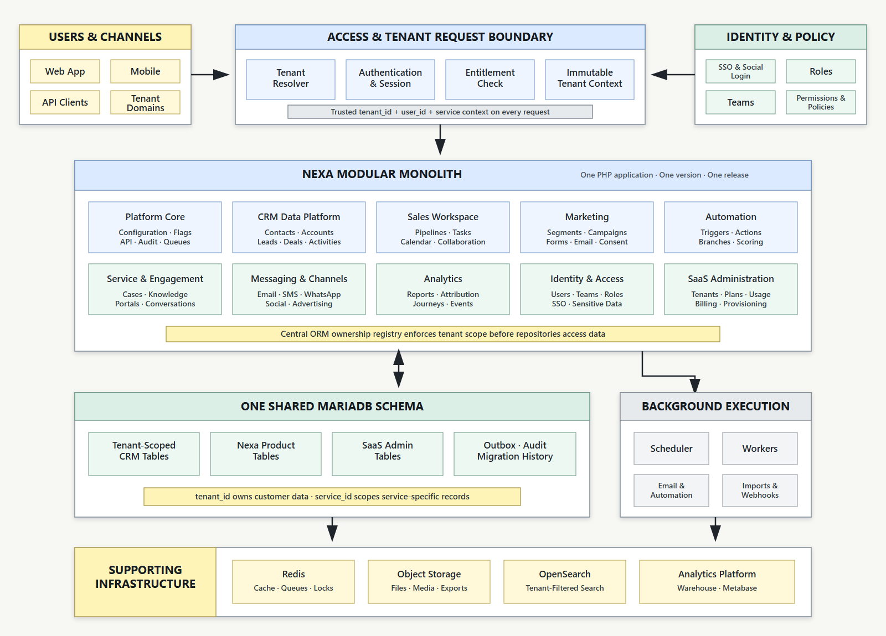

# EspoCRM to Nexa CRM SaaS: Architecture Recommendation

**Prepared for:** Nexa CRM project stakeholders

**Date:** 15 July 2026

**Status:** Recommended architecture for team approval

## Executive Summary

EspoCRM 9.1.9 is a useful foundation for Nexa CRM because it already provides mature CRM entities, permissions, activities, APIs and administration capabilities. However, it is designed primarily as a single-organization application. It is not a complete multi-tenant SaaS platform.

The principal architectural gap is tenant isolation. The current application initializes a central ORM and database connection for one configured database. It does not natively identify a SaaS tenant and enforce that tenant across every query, relationship, background job, cache key, attachment, export and integration.

We considered modifying all existing EspoCRM tables to add `tenant_id` and placing every customer in one shared CRM schema. Although possible, this would create a large permanent fork and make customer isolation dependent on every current and future code path remembering the correct tenant condition. One missed condition could expose one customer's data to another.

We therefore recommend two complementary architecture decisions:

- **Application architecture:** a modular PHP monolith for the customer-facing product, with clear internal module boundaries, shared contracts and one release process. Background workers use the same product contracts. Separate services are introduced only for distinct SaaS control-plane, scaling, security or workload needs.
- **Data and deployment architecture:** a cell-based, database-per-tenant model for transactional customer data.

The target topology applies these decisions as follows:

- A small shared control plane manages tenants, domains, plans, subscriptions, entitlements, database placement and provisioning.
- Each customer receives one logical tenant database containing both the existing EspoCRM core tables and every new Nexa CRM, marketing, automation and service table for that customer.
- Multiple logical tenant databases share the same MariaDB cluster initially. This does not require one physical database server per customer.
- The same versioned Nexa/Espo application code serves all tenants.
- High-volume tracking and analytics are separated from transactional CRM workloads as the product grows.

This approach provides stronger isolation, preserves EspoCRM's existing data behavior, supports individual customer backup and restore, and gives the small development team a safer route to a commercial SaaS product.

## 1. Current EspoCRM Position

### 1.1 What EspoCRM Provides

EspoCRM already supplies valuable product foundations:

- Accounts, Contacts, Leads and Opportunities.
- Cases, activities, tasks, calls, meetings and calendars.
- Emails, templates, campaigns, target lists and mass-email foundations.
- Users, teams, roles, permissions and portals.
- Entity metadata, layouts, APIs, scheduled jobs and webhooks.
- Import, export, duplicate detection, notes and attachments.
- A PHP ORM and extension structure for custom server and client modules.

These capabilities make EspoCRM a reasonable product foundation. Nexa does not need to rebuild basic CRM behavior from zero.

### 1.2 What EspoCRM Does Not Provide Natively

EspoCRM does not provide the full operating model required by a multi-customer SaaS platform:

- Tenant registry and domain routing.
- Guaranteed customer isolation across all storage and execution paths.
- Automated tenant provisioning, suspension, cloning and deletion.
- Subscription plans, billing and feature entitlements.
- Per-tenant quotas and usage metering.
- Fleet-wide tenant schema migrations.
- Per-tenant backup and restore orchestration.
- Cell placement, capacity management and regional residency.
- SaaS operator tooling and controlled support impersonation.
- Tenant-aware event ingestion, analytics and provider-cost controls.

EspoCRM permissions protect users and teams inside one organization. They should not be treated as the security boundary between unrelated paying customers.

### 1.3 Evidence From the Pinned Source

The local EspoCRM 9.1.9 source review found:

- 91 core and CRM entity definitions before Nexa modules are added.
- A central `EntityManager` constructed with one `DatabaseParams` object.
- Database connection factories that select a configured database name.
- No native `TenantContext` or global multi-tenant query scope in the reviewed application code.

This means shared-schema tenancy would affect much more than the visible screens the team plans to redesign.

## 2. Why UI Customization Does Not Solve Tenancy

The project intends to redesign every major EspoCRM workflow and add substantial marketing functionality. That gives the team control over the user experience, but tenant isolation also exists below the user interface.

Adding a `tenant_id` column to a table is straightforward. Reliably enforcing it requires changes and tests across:

- ORM reads, writes, deletes and aggregate queries.
- Relationship and many-to-many join tables.
- Unique constraints and duplicate detection.
- Authentication, password reset and user lookup.
- Global search, autocomplete and dashboards.
- Reports, exports and bulk operations.
- Scheduled jobs, email queues and workflow workers.
- Webhooks, API endpoints and provider callbacks.
- Raw SQL in existing code, extensions and future integrations.
- Cache keys, locks, sessions and rate limits.
- Attachments, imports, exports and generated files.
- Search indexes, analytics events and backups.

Reviewing every visible feature cannot prove that every internal query path has been covered. The architecture should provide protection even when a developer makes a normal mistake.

## 3. Options Considered

| Option | Advantages | Principal risks | Decision |
|---|---|---|---|
| Shared CRM schema with `tenant_id` | Simple database count, easy aggregate queries, simple initial provisioning | Large Espo fork, application-only isolation, difficult tenant restore/deletion, high breach impact | Not recommended initially |
| Separate physical stack for every tenant | Very strong isolation and simple reasoning | High cost and operational overhead at scale | Optional for enterprise tenants |
| Logical database per tenant on shared cells | Strong data boundary, preserves Espo behavior, individual restore/move, shared infrastructure cost | Requires provisioning and fleet migration tooling | Recommended |
| Database shared by subscription plan | Fewer databases than per tenant | Plan changes require migration and customers remain co-mingled | Rejected |

## 4. Recommended Target Architecture

### 4.1 Application Architecture: Modular Monolith

The main Nexa product is one versioned PHP application and one coordinated user experience. Its internal modules cover platform core, CRM, sales, marketing, automation, service, conversations, reporting, identity and tenant administration. Modules own their metadata, services, views, jobs and tests behind deliberate boundaries even though they are deployed together.

This is not a full microservices architecture. With two developers, splitting every product area into independently deployed services would add service discovery, distributed transactions, API versioning, deployment coordination, observability and local-development overhead before the product demonstrates a scaling need.

The modular monolith does not prohibit supporting services. A responsibility can be extracted when it has a clear contract and a concrete reason such as independent scaling, stronger isolation, specialist storage, provider processing or a different failure profile. The SaaS control plane, event ingestion and high-volume analytics are the initial separate boundaries.

Background and queue workers run independently from web requests but use the same versioned application code and tenant-context contracts. Every queued job must identify its tenant and cell.

### 4.2 Control Plane

The control plane is a small Nexa-owned PHP service. Laravel is a reasonable implementation option because it provides mature migrations, queues, authentication and billing integration, but the framework decision can be made separately.

The control plane stores:

- Tenant identity, status, region and domain mappings.
- Cell and MariaDB-cluster placement.
- Opaque database name and secrets-manager references.
- Plans, features, entitlements and subscription references.
- Aggregate usage and billing-period counters.
- Provisioning, migration and backup status.
- Audited platform-operator actions.

It must not store ordinary contacts, deals, message bodies, attachments or other customer CRM data.

### 4.3 Tenant Database

One logical tenant database contains the complete transactional product for one customer:

- All required EspoCRM tables.
- Nexa custom CRM tables and metadata.
- Marketing contacts, consent, segments and campaigns.
- Marketing-email definitions and suppression records.
- Automation definitions, executions and history.
- Conversations, scoring, attribution and tenant integrations.
- Transactional outbox records for reliable external event delivery.
- Applied tenant-schema migration history.

All tenant databases use one canonical schema version. Product plans are enforced through entitlements, not different schemas.

### 4.4 Shared Infrastructure

- A gateway resolves customer domains and routes requests.
- Redis handles cache, queues, distributed locks and rate limits with tenant-prefixed keys.
- Object storage keeps attachments, imports, exports and media under immutable tenant prefixes.
- OpenSearch supports global search and high-volume event queries with enforced tenant boundaries.
- An analytics database with Metabase or an equivalent reporting tool serves governed reporting models.
- Dedicated workers process marketing email, automation, imports, webhooks and scheduled jobs with immutable tenant context.
- A secrets manager stores database and provider credentials.
- Central logs, metrics and traces include tenant, cell and request identifiers.

These components support the modular monolith; they do not turn every product module into a microservice. Each addition requires tenant-isolation tests, monitoring, backup or recovery procedures and a supported local-development path.

## 5. How a Request Reaches the Correct EspoCRM Data

1. A user opens `customer-a.nexa.example`.
2. The gateway normalizes the hostname.
3. The control plane finds Customer A and verifies that the tenant is active.
4. It resolves Customer A's cell, cluster, database and credential reference.
5. The application creates an immutable tenant context.
6. EspoCRM starts with a connection to Customer A's database.
7. Existing Espo queries operate normally but can physically see only Customer A's CRM records.
8. Logs, jobs, cache keys, files and events receive Customer A's tenant identifier.

The browser or API caller must never provide a raw database name or credential reference.

## 6. Why This Recommendation Best Fits Nexa

### 6.1 It Works With EspoCRM Instead of Rebuilding Its ORM

EspoCRM continues operating within its expected single-organization database boundary. The team can focus on product modules and design instead of permanently patching every existing query.

### 6.2 It Reduces Customer-Data Risk

A query without a tenant filter remains confined to the selected tenant database. Database credentials, storage prefixes, cache keys and job context provide additional boundaries.

### 6.3 It Does Not Require One Server Per Customer

One MariaDB cluster may host many logical tenant databases. Cells are added only when capacity, region or risk requires them. Dedicated cells remain an enterprise option.

### 6.4 It Supports SaaS Operations

A customer database can be backed up, restored, cloned into a sandbox, moved to another cluster, placed in a specific region or securely deleted without extracting rows from a shared CRM schema.

### 6.5 It Is More Realistic for a Two-Person Team

The architecture creates operational work around provisioning and migrations, but that work is explicit and automatable. Shared-schema tenancy would distribute security-sensitive work across almost every feature both developers build. A modular monolith also keeps delivery, debugging, testing and local setup manageable without closing the door to later service extraction.

## 7. Trade-Offs and Mitigations

| Trade-off | Mitigation |
|---|---|
| Many logical databases must be migrated | Build a schema-fleet runner with checksums, cohorts, pause thresholds and status tracking |
| Cross-tenant reporting cannot join CRM databases | Send governed aggregate/event data to an analytics platform |
| Connection counts grow with tenants | Use bounded cells, connection management and measured capacity limits |
| Provisioning is more complex | Use an idempotent provisioning workflow and canonical database template/migrations |
| Support staff cannot query every tenant casually | Provide audited, time-limited operator workflows and tenant health summaries |
| Restore and moves require routing updates | Restore into a new database, verify it, then atomically update tenant placement |

## 8. Database and Migration Strategy

### Control Plane

The current initial migration establishes tenants, domains, cells, database clusters, tenant placement, plans, features, entitlements, subscriptions, usage and provisioning operations.

### Tenant Schemas

- Use Espo custom metadata for normal entities, fields, relationships and indexes.
- Use explicit SQL migrations for transformations and structures Espo rebuild cannot safely express.
- Never edit a migration after it has been released.
- Apply expand/migrate/contract for risky changes.
- Test every migration against a clean 9.1.9 database and a populated previous-version fixture.
- Record migration filename, checksum and result separately for every tenant.

### Developer Databases

Each developer has an independent local database server or container containing a local control database and disposable tenant databases. Database structure and safe synthetic fixtures move through Git; database volumes and SQL dumps do not.

Docker and XAMPP can both serve the PHP application, but the team must align PHP extensions and MariaDB 10.11 behavior.

## 9. Implementation Plan

### Stage 1: Phase 0 Baseline

- Approve this report and ADR-0001.
- Maintain the public Git remote and protect the `main` branch.
- Align Docker and XAMPP versions.
- Establish migration, seed, CI and review rules.
- Keep the existing EspoCRM database unchanged while the architecture spike is built.

### Stage 2: Tenancy Proof of Concept

- Create two disposable tenant databases from the same schema.
- Route two local hostnames through the same Nexa application code.
- Resolve tenant placement before Espo's ORM is initialized.
- Prove separate login, Contacts, Accounts and Opportunities.
- Test cross-tenant API, search, cache, files and background jobs.

This proof must pass before broad dashboard and module customization continues.

### Stage 3: Control Plane and Provisioning

- Implement tenant/domain registry and placement APIs.
- Add idempotent provisioning, suspension and deletion.
- Add secrets-manager integration.
- Add plan entitlements and usage events.
- Add fleet schema-version and backup status.

### Stage 4: Canonical Nexa Tenant Product

- Build the Nexa design system and redesigned CRM modules.
- Add marketing, automation and conversation modules to the same canonical tenant schema.
- Add transactional outbox and tenant-aware workers.
- Release schema changes through migration cohorts.

### Stage 5: Production Hardening

- Automate backup, restore, tenant moves and disaster recovery.
- Add cell capacity management, observability and rate limits.
- Complete tenant-isolation, penetration, load and recovery testing.
- Add analytics/event infrastructure before high-volume marketing rollout.

## 10. Mandatory Security Gate

No second real customer should be onboarded until automated tests prove isolation across:

- Authentication and password recovery.
- Database connections and APIs.
- Background and scheduled jobs.
- Cache, sessions and rate limits.
- Attachments, imports and exports.
- Search and analytics.
- Webhooks and external integrations.
- Backup, restore and deletion.
- Platform support and impersonation.

## 11. Licensing Consideration

The bundled EspoCRM source identifies the application as AGPLv3 and includes an additional legal-notice requirement concerning the EspoCRM name in modified interactive interfaces. The team should obtain qualified open-source licensing advice before commercial launch, particularly for branding, source-availability obligations, hosted modifications and distribution of extensions. This report is an engineering recommendation, not legal advice.

## 12. Decision Requested

Stakeholders are asked to approve the following:

1. EspoCRM 9.1.9 remains the pinned CRM foundation.
2. The main customer-facing product uses a modular PHP monolith with explicit internal module boundaries and one coordinated release process.
3. Background workers share the versioned application code and immutable tenant-context contracts.
4. Nexa uses a cell-based, logical database-per-tenant model for transactional customer data.
5. Espo core and all Nexa customer features live together inside each tenant database.
6. A separate shared control plane stores only SaaS routing, commercial and operational metadata.
7. Multiple logical tenant databases share MariaDB clusters; dedicated cells are optional.
8. Redis, object storage, OpenSearch, analytics and dedicated workers are introduced as supporting infrastructure when justified.
9. High-volume event and analytics workloads are separated from transactional CRM when required.
10. The team completes the tenancy proof of concept before broad product customization.
11. A legal review is required before final rebranding and commercial launch.

## Conclusion

EspoCRM is suitable as the CRM engine inside Nexa, but it should not be treated as an already multi-tenant SaaS platform. Retrofitting shared-schema tenancy into every existing and future Espo path would consume significant engineering effort while leaving customer isolation dependent on perfect application filtering.

The recommended modular-monolith and cell-based architecture retains the value of EspoCRM, keeps the product manageable for the current team, keeps all customer-specific core and new functionality together, provides stronger isolation and creates a credible path to a scalable SaaS product. Supporting services are added deliberately when their operational value exceeds their complexity.
